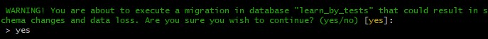
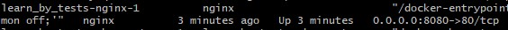

# Learn By Tests
This project is the MVP version. This is a simple application that allows you to create closed tests.
Currently, it has database with tests for the Polish Yacht Sea Helmsman exam.

The application can be found at https://learnbytests.vxm.pl, after registration, please write me an e-mail at: p.czyzewski5@gmail.com to activate your account.

## Local environment requirements
Console, docker, docker-compose, make, internet.

## How to launch on the local environment
1. navigate to project dir in console and execute `make start`
2. answer `yes` on migration prompt 
3. when console is ready execute `docker-compose ps` and locate port near nginx container e.g `8080` 
4. navigate to localhost with found port e.g `localhost:8080` and login with `example@test.com` and `Pass123@`